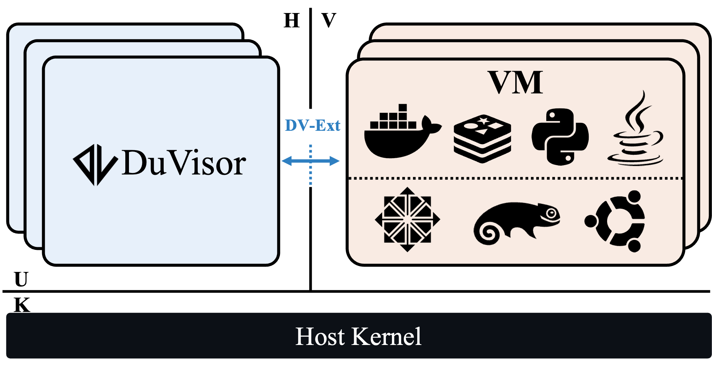
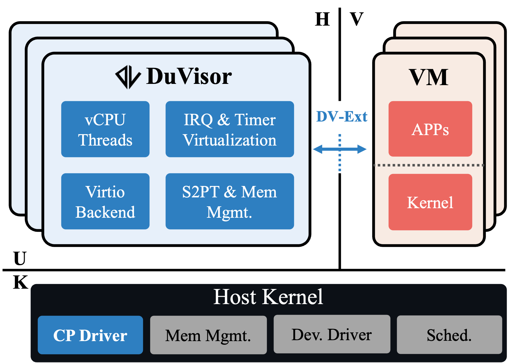
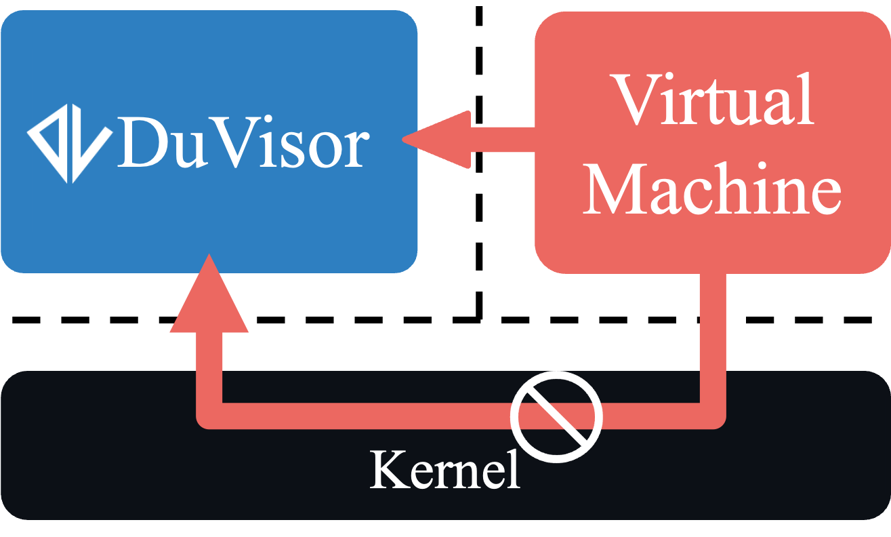

<picture>
    <source media="(prefers-color-scheme: dark)" srcset="./figures/logo-long-dark.png">
    <source media="(prefers-color-scheme: light)" srcset="./figures/logo-long-light.png">
    
</picture>

DuVisor is a user-level hypervisor with high performance based on delegated virtualization. It deprivileges all the vulnerable subsystems of traditional hypervisors into user space, reducing the host kernel’s attack surface and preventing any of hypervisor's vulnerabilities from jeopardizing it. The Rust language and one-to-one model further ensures the isolation and reliability.

# DuVisor

[](https://github.com/IPADS-DuVisor/DuVisor/actions/)[](https://blog.rust-lang.org/)

<picture width="600px">
    <source media="(prefers-color-scheme: dark)" srcset="./figures/overview-dark.png">
    <source media="(prefers-color-scheme: light)" srcset="./figures/overview-light.png">
    
</picture>

<!--ts-->
* [DuVisor](#duvisor)
   * [Why DuVisor](#why-duvisor)
   * [Duvisor's Architecture](#duvisors-architecture)
   * [Quick Start](#quick-start)
      * [Prerequisite](#prerequisite)
      * [Build DuVisor for QEMU](#build-duvisor-for-qemu)
      * [Run Example VM on QEMU](#run-example-vm-on-qemu)
      * [Build DuVisor for FireSim](#build-duvisor-for-firesim)
<!--te-->

## Why DuVisor

Compared with the traditional virtualization, DuVisor has the following advantages.

1. High Security: A deprivileged hypervisor eliminates the kernel’s attack surface introduced by virtualization. The one-to-one service model further enhances the isolation between VMs and the fault tolerance of the entire system.

2. Near-native Performance: Getting rid of redundant mode switching completely unleash the potential performance of virtualization. The integrated design further enhances the cooperation between modules to make the code more efficient.

3. Agile Development: Benefit from the thriving software environment in user space, DuVisor is no longer restricted by the kernel development environment and can freely choose the programming language and existing libraries. The project currently uses Rust to ensure security and takes advantage of the powerful testing framework it provides to improve the quality of the project.

4. Flexible Operations and Maintenance: DuVisor can be upgraded without rebooting the host system. New features and functionalities can be deployed more quickly. Cloud services will have better fault tolerance benefiting from DuVisor's strong isolation.

## Duvisor's Architecture

DuVisor serves VMs directly in user space with a one-to-one model to bring greater isolation to the entire system.

<picture width="600px">
    <source media="(prefers-color-scheme: dark)" srcset="./figures/arch-dark.png">
    <source media="(prefers-color-scheme: light)" srcset="./figures/arch-light.png">
    
</picture>

With a seperate hypervisor process that serves only itself, a VM gains stronger isolation from other VMs and DuVisor processes. The host kernel is also free from the hypervisor's security vulnerabilities.

<picture width="400px">
    <source media="(prefers-color-scheme: dark)" srcset="./figures/arch-isol-dark.png">
    <source media="(prefers-color-scheme: light)" srcset="./figures/arch-isol-light.png">
    
</picture>

All data interactions between the VM and the hypervisor are no longer intervened by the host kernel as in traditional virtualization. DuVisor can directly handle the traps from VMs in a more integrated way, which reduces complexity while boosting the performance. 

DuVisor relies on a new hardware extension called DV-Ext to catch VM exits directly in user space. The hardware extension imports VM exits directly into the user state and provides virtualization-related registers to the user-level software to access VM states and control VM behaviors.

<picture width="400px">
    <source media="(prefers-color-scheme: dark)" srcset="./figures/arch-plane-dark.png">
    <source media="(prefers-color-scheme: light)" srcset="./figures/arch-plane-light.png">
    
</picture>

DuVisor is developed in user space making it more flexible than kernel modules. For example, it uses the Rust language to build the main functionalities and thus obtains great security. At the same time, DuVisor is also able to quickly reuse rich off-the-shelf projects, such as Firecracker's I/O backend.

## Quick Start

### Prerequisite

Hardware requirements:

* CPU: Commodity CPU with >= 4 cores which is able to run qemu. Architecture is not limitted.
* Memory: >8GB

First, clone this repository:

```bash
git clone https://github.com/IPADS-DuVisor/DuVisor
cd DuVisor
git submodule update --init --recursive
```

We provide a docker image to build the whole environment for x86-64 CPUs, as well as the [Dockerfile](./scripts/opensource/Dockerfile) of this image.

(Optional) To set up native environment for building, you can follow the Dockerfile.

Install Docker: https://docs.docker.com/engine/install/ubuntu/

Prepare source code for guest VM:
```bash
wget https://cdn.kernel.org/pub/linux/kernel/v5.x/linux-5.11.tar.xz
tar xf linux-5.11.tar.xz
mv linux-5.11 linux-guest
```

Prepare source code of busybox for rootfs:
```bash
mkdir -p prepare
cd prepare
git clone https://github.com/kvm-riscv/howto.git
wget https://busybox.net/downloads/busybox-1.33.1.tar.bz2
tar xf busybox-1.33.1.tar.bz2
mv busybox-1.33.1 rootfs
cd ..
```

### Build DuVisor for QEMU

You can build DuVisor and other elements for executing DuVisor (host/guest Linux kernel, rootfs, opensbi) via **one of** the following two scripts: 

[Build via docker](./scripts/quick_docker_build.sh):

```bash
./scripts/quick_docker_build.sh
```

[Native build](./scripts/quick_native_build.sh):

```bash
./scripts/quick_native_build.sh
```

### Run Example VM on QEMU

If you use docker build in last step:

```bash
./scripts/build/docker_exec_wrapper.sh ./scripts/run/example_boot.sh

# In qemu
cd duvisor
./boot.sh
```

If you use native build in last step:

```bash
./scripts/run/example_boot.sh

# In qemu
cd duvisor
./boot.sh
```

You would see `DUVISOR` then.

Reference bootlog:
```
bash> ./scripts/run/example_boot.sh

OpenSBI v0.8                                                                                                           
   ____                    _____ ____ _____                                                                            
  / __ \                  / ____|  _ \_   _|                                                                           
 | |  | |_ __   ___ _ __ | (___ | |_) || |                                                                             
 | |  | | '_ \ / _ \ '_ \ \___ \|  _ < | |                                                                             
 | |__| | |_) |  __/ | | |____) | |_) || |_                                                                            
  \____/| .__/ \___|_| |_|_____/|____/_____|                                                                           
        | |                                                                                                            
        |_|                                                                                                            
                                                                                                                       
Platform Name             : riscv-virtio,qemu

/* Skip some of the log */

[    0.299693] Key type dns_resolver registered
[    0.315945] Freeing unused kernel memory: 192K
[    0.328555] Run /init as init process
           _  _
          | ||_|
          | | _ ____  _   _  _  _ 
          | || |  _ \| | | |\ \/ /
          | || | | | | |_| |/    \
          |_||_|_| |_|\____|\_/\_/

               Busybox Rootfs

Please press Enter to activate this console. 
/ # cd duvisor
/duvisor # ./boot.sh                                                 
[debug] cmdline: append: root=/dev/ram console=ttyS0 earlycon=sbi
                                                                                                                       
                                                           
    ,------.         ,--.   ,--.,--.                               
    |  .-.  \ ,--.,--.\  `.'  / `--' ,---.  ,---. ,--.--.     
    |  |  \  :|  ||  | \     /  ,--.(  .-' | .-. ||  .--'     
    |  '--'  /'  ''  '  \   /   |  |.-'  `)' '-' '|  |    
    `-------'  `----'    `-'    `--'`----'  `---' `--'    
                                                           
                                                                  
Welcome to DUVISOR (Qemu)

/* Skip some of the log */

[    1.271158] Freeing unused kernel memory: 2144K
[    1.298522] Run /init as init process
           _  _
          | ||_|
          | | _ ____  _   _  _  _ 
          | || |  _ \| | | |\ \/ /
          | || | | | | |_| |/    \
          |_||_|_| |_|\____|\_/\_/

               Busybox Rootfs

Please press Enter to activate this console. 
/ # cat /proc/cpuinfo
processor       : 0
hart            : 1
isa             : rv64imafdcsu
mmu             : sv48

processor       : 1
hart            : 0
isa             : rv64imafdcsu
mmu             : sv48
/ # poweroff -f
[  120.441885] reboot: Power down
Poweroff the virtual machine by vcpu 1
[  127.298790] IOCTL_DUVISOR_UNREGISTER_VCPU: tid = 67
[  127.298805] IOCTL_DUVISOR_UNREGISTER_VCPU: tid = 68
DuVisor VM ended normally.
Finish vm running...
[  127.348446] vplic_dev_release:419 tgid = 66
[  127.348795] vplic_dev_release:406 tgid = 66 ulh_vm_data is NULL vplic!
[  127.349096] dv_driver_release:449 tgid = 66 ulh_vm_data is NULL!
/duvisor #
```

### Build DuVisor for FireSim

To run DuVisor on the FireSim platform, you only need to checkout to the `firesim` branch and apply a `firesim.patch` to the guest kernel code.
Other steps are the same as [Build DuVisor for QEMU](#build-duvisor-for-qemu).

To apply `firesim.patch` to the guest kernel code:

```bash
wget https://cdn.kernel.org/pub/linux/kernel/v5.x/linux-5.11.tar.xz
tar xf linux-5.11.tar.xz
mv linux-5.11 linux-guest
cd linux-guest
patch -p1 < ../firesim.patch
```

To run on FireSim, please use the Rocket-Chip with DV-ext enabled.
We have provided a compiled hardware on AWS, you can refer to our AE for more details:

```bash
# config_runtime.ini
defaulthwconfig=firesim-rocket-quadcore-nic-l2-llc4mb-ddr3-ulh-VNA-4TLB-4PTW-IBCN-vssip

# config_hwdb.ini
[firesim-rocket-quadcore-nic-l2-llc4mb-ddr3-ulh-VNA-4TLB-4PTW-IBCN-vssip]
agfi=agfi-0e385553b7716f177
deploytripletoverride=None
customruntimeconfig=None
```
